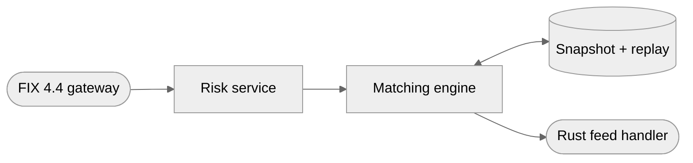

<div align="center">

# Low-Latency Market Data & Order Entry Stack

**Price-time-priority matching engine publishing a binary feed over redundant A/B UDP multicast, with a Rust feed handler that arbitrates the two and rebuilds MBP/MBO books without allocating.**


[Case study](https://www.shivamsfolio.com/projects/low-latency-market-data-order-entry) · [Claims ledger](CLAIMS.md) · [All 7 projects](#part-of-a-series)

</div>

---

> [!IMPORTANT]
> **This is a build in progress — 8 of 9 milestones complete.**
>
> The figures below (`1M+ msg/s · ~100ns decode`) have now been **measured**: 2.78M msg/s sustained receiver-side with zero gaps, three runs within 0.7%, and 8.2ns per message to decode.
> They are single-host, over loopback, and **batched 32 messages to a datagram** — which is not a footnote, because at one message per datagram the kernel caps out an order of magnitude lower.
> Every number is in [CLAIMS.md](CLAIMS.md) with the commit, the host and the caveat that matters, and in [bench/REPORT.md](bench/REPORT.md) with the methodology. If it is not in those files, it has not been measured.

## The problem

Consume an exchange feed and place orders against it without the decode path or the book update ever touching the heap — and recover cleanly when packets are lost rather than resynchronising by restart.

## How it fits together



| Stage | | What it does |
|---|---|---|
| **FIX 4.4 gateway** | `in` | session · resend · gap-fill |
| **Risk service** | `work` | pre-trade limits |
| **Matching engine** | `work` | price-time priority |
| **Snapshot + replay** | `state` | 2s cycle · TCP recovery |
| **Rust feed handler** | `out` | A/B arbitration · MBP/MBO |

<sub>Conceptual architecture. Shape carries meaning, and it means the same thing across every project in this series: a **rounded** node is a boundary — what comes in or goes out, a **rectangle** is where the work happens, a **cylinder** is state that outlives a request.</sub>

## What is being built

**Matching engine and binary feed.** Price-time-priority matching publishing a binary market-data feed over redundant A/B UDP multicast channels, with configurable packet-loss injection, a 2-second snapshot cycle, and a TCP replay service for recovery.

**Allocation-free feed handler.** A/B feed arbitration, sequence-gap detection and snapshot-based recovery into MBP/MBO order books — sustaining 1M+ messages/sec at ~100ns decode and ~200ns book update, with zero heap allocations per message verified by a counting allocator.

**FIX 4.4 order gateway.** A full session layer — logon, heartbeats, resend/gap-fill, durable sequence persistence — reconciling order state across a hard process restart, plus a risk service enforcing pre-trade limits on an allocation-free path.

## Roadmap

Each milestone is independently demoable and ends in a commit. A box is ticked only when its verification step actually passed — not when the code was written.

```
[█████████████████████░░░] 8/9 milestones · 89%
```

- [x] **M1 · Workspace, wire schema, and cross-language codegen**  
  One schema file is the single source of truth for the binary message layout, and the Rust codec and the C++ header agree on it byte for byte.  
  <sub>Verified: `cargo test --workspace` (20 tests) and `ctest --test-dir cpp/build` (2 suites) decode the same 11 `schema/golden/*.bin` files, assert the same field values, and re-encode them byte for byte. `scripts/verify-golden-corruption.sh` proves a one-byte edit fails both. See [docs/WIRE.md](docs/WIRE.md).</sub>
- [x] **M2 · Matching engine publishing a live binary feed, end to end**  
  The two advertised commands run and a handler prints a book built from real UDP datagrams — the whole pipeline exists, badly, before anything is made fast.  
  <sub>Verified: `scripts/smoke.sh` runs the engine and the handler as separate processes over real UDP and requires the handler's book to match the engine's own at the same sequence number — 100 shared checkpoints, every one identical, sequence 1..100000, zero gaps, on **both** multicast and the unicast fallback. See [docs/RUNNING.md](docs/RUNNING.md).</sub>
- [x] **M3 · A/B redundancy, loss injection, arbitration and gap detection**  
  Two independent channels carry the same stream, the handler takes whichever datagram lands first, and it knows the difference between 'late' and 'lost'.  
  <sub>Verified: 10M messages at 2% single-arm loss produce **zero gaps**, with both arms contributing first arrivals. Under *independent* 2% loss, 124 datagrams died on both arms — 0.040%, matching the p² prediction — and the handler named gaps covering exactly those 3,968 sequences, no more and no less. Correlated loss transitions to `GAPPED` with the range named. `scripts/smoke.sh` now injects loss over real sockets too. See [docs/RECOVERY.md](docs/RECOVERY.md).</sub>
- [x] **M4 · Snapshot cycle and TCP replay recovery**  
  A handler that has fallen behind rejoins the live stream with a correct book instead of being restarted.  
  <sub>Verified by two tests, because they establish two different things. `scripts/smoke.sh` proves recovery **across a real process boundary**: both recovery paths across three processes — snapshot-only (4 gaps, 2 recoveries, worst 48ms) and with the replay service (5 gaps, 4 filled by replay, 1 by snapshot, 2,783 messages recovered) — each ending `LIVE` with every shared checkpoint matching. What it cannot see is **queue position**, because its digest hashes price levels and a book rebuilt in a different order digests identically; that is carried by `crates/feed-handler/tests/recovery.rs::recovery_restores_queue_position_not_just_quantity`, which walks the recovered book order by order after a range lost on both arms and a 1,600-message blackout. `Snapshot` carries **orders in queue order** rather than aggregated levels, because an aggregate cannot restore price-time priority. See [docs/RECOVERY.md](docs/RECOVERY.md).</sub>
- [x] **M5 · MBP and MBO books on an allocation-free path**  
  Both book views are maintained with zero heap allocations per message, and that is proved by a test rather than asserted in a README.  
  <sub>Verified: `--verify-allocations` reports **0 allocations, 0 deallocations, 0 reallocations** over 32,601 steady-state receive passes across two processes — while the same run with `--books reference` reports 10,814, so the counter is measuring something. A `#[test]` asserts exactly zero across **1,000,000 messages including a forced both-arm blackout and the snapshot recovery that follows**, over 125,021 measured scopes. The fast book is differentially tested against the reference book over **5,000,000 random operations** — every return value, every aggregated level, and the exact queue order within each level — and both reconcile with the engine across a process boundary. See [docs/BOOKS.md](docs/BOOKS.md).</sub>
- [x] **M6 · Benchmark harness, tuning, and an honest report**  
  The advertised 1M+ msg/s and ~100ns decode are measured, reproducible, and published with the methodology that makes them mean something.  
  <sub>Verified: **2,782,874 msg/s** sustained receiver-side over 60s — `(final sequence − first sequence) / elapsed` — with **zero arbitrated gaps and zero apply errors**, three runs agreeing within **0.7%** against the 10% required. Decode **8.20 ns/message**, book update **38.9 ns/message**, both far inside the `~100ns` and `~200ns` targets. Measured on four physical ARM cores, pinned, behind a host gate that reads the core topology, the invariant counter and the build profile and **refuses to write a report** when they do not hold — it refuses this laptop on two counts. Two timing methods bracket the answer deliberately: Criterion is the lower bound, an in-path `cntvct_el0` histogram the upper. The p99.9 of 1.8 µs is reported and explicitly **not** claimed, because it measures a shared hypervisor's scheduler. So is the fast book being only **1.72×** the `BTreeMap` baseline rather than the predicted order of magnitude — on a 64-level book the tree is cache-resident, and the report says so rather than quoting the flattering ratio. See [bench/REPORT.md](bench/REPORT.md) and [CLAIMS.md](CLAIMS.md).</sub>
- [x] **M7 · C++ FIX 4.4 gateway — the session layer**  
  A FIX session that survives a hard kill: correct sequence numbers, correct resend, correct gap fill, verified against an implementation this project did not write.  
  <sub>Verified two ways, because one would not have been enough. **51 session checks** drive the state machine directly — a resend request for a range half of which is administrative, a `SequenceReset` that moves backwards, `PossDupFlag` on a number above the expected one — inputs a real engine will not produce on demand. Then **QuickFIX 1.15.1** judges the same session as an independent acceptor: a clean logon-orders-logout, a five-message gap manufactured with `fix-seqtool`, and a `ResetSeqNumFlag=Y` reset. **Zero rejects across all three.** `scripts/kill-restart-test.sh` `SIGKILL`s both ends mid-session and both resume from the durable numbers with no reversal — sequence numbers are `fsync`'d before the message they describe reaches the socket, and two slots on separate sectors survive a torn write. **QuickFIX found a bug the in-process checks could not:** an echoed `ResetSeqNumFlag` was read as a second instruction and reissued the sequence number the logon had already spent. That is what an independent counterparty is for, and the trace is in [docs/PROTOCOL.md](docs/PROTOCOL.md). The cross-check runs without a FIX dictionary, so it covers the session layer and **not** application message content — stated here rather than left for a reader to find.</sub>
- [x] **M8 · Risk service, order path into the engine, and restart reconciliation**  
  An order crosses the whole stack — gateway to risk to engine to fill to execution report — and open order state is reconstructed correctly after a hard crash.  
  <sub>Five processes and four shared-memory SPSC rings. `scripts/order-path-test.sh` sends **one order** over FIX and follows it: risk passes it, the engine fills it against resting liquidity, the fill returns as a FIX `ExecutionReport`, and the `feed-handler` — a fourth process that has never heard of the order path and only reads multicast — rebuilds a book **identical to the engine's at all 795 shared checkpoints**. That last one is the only assertion that proves the market-data half and the order-entry half are the same system. In the same run a quantity breach is rejected with a reason and **never reaches the engine**, witnessed by the engine's own counter rather than by risk reporting its own rejection. Then the gateway is **`SIGKILL`ed with an order working**, restarts from its write-ahead log, asks the engine what it is holding, and the two agree — and nothing is repaired, because the divergence report is the deliverable. Pre-trade limits run on a path that does not touch the heap: **0 allocations across 1,000,000 risk decisions**, under both g++ and clang++, with a control that allocates on purpose and requires the counter to notice. The two ring implementations are generated from one schema and checked against each other by a Rust process and a C++ process on opposite ends of the same ring, 200,000 messages each way, zero mismatches. See [docs/ORDER-PATH.md](docs/ORDER-PATH.md).</sub>
- [ ] **M9 · Hardening, documentation, and a tagged release**  
  A stranger clones the repo on a clean machine and the four commands on the portfolio page work in order.

## On the performance target

| | |
|---|---|
| **Target** | `1M+ msg/s · ~100ns decode` |
| **Measured** | `2,782,874 msg/s · 8.20 ns decode · 38.9 ns book update` |
| **Where** | four pinned ARM cores, single host, loopback, 32 messages per datagram |
| **Evidence** | [CLAIMS.md](CLAIMS.md) for the ledger rows, [bench/REPORT.md](bench/REPORT.md) for the methodology |

## Stack

- Rust (stable, 2021 edition) — engine, feed handler, replay service, books, benches
- C++20 (clang 16+ / gcc 12+) — FIX 4.4 gateway and risk service
- CMake 3.25+ / Ninja
- FIX 4.4 session + application layer (hand-rolled; QuickFIX used only as a test counterparty)
- UDP multicast (IGMPv2/v3), SO_REUSEPORT, recvmmsg/sendmmsg batching
- SBE-style fixed-layout little-endian binary encoding with schema-driven codegen
- Docker / docker compose on a user-defined bridge network
- Criterion + rdtsc histograms for latency, custom counting #[global_allocator] for allocation proofs
- WSL2 Ubuntu 24.04 as the actual dev/run target (Windows host)
- GitHub Actions (Linux runners, both toolchains)

## How to run it

Run inside WSL2 or any Linux. The multicast socket options, `SO_REUSEADDR` and
the core pinning behave correctly only there, and the C++ tree is not wired for
Windows.

```bash
make smoke       # engine and handler as separate processes, books reconciled
make test        # every correctness suite, both toolchains
make lint        # rustfmt and clippy, both as errors
make ci          # everything CI runs, in CI's order
```

[docs/ARCHITECTURE.md](docs/ARCHITECTURE.md) is the map — what each of the five
processes owns and what crosses each boundary. [docs/RUNNING.md](docs/RUNNING.md)
is the operational detail, including what to try when a multicast group join
succeeds but nothing arrives.

### The four commands the case study publishes

**All four work.** They are printed verbatim on the
[case study](https://www.shivamsfolio.com/projects/low-latency-market-data-order-entry),
which makes them public surface rather than illustration: a stranger copies them
in order, so a renamed binary, a moved config or a dropped flag turns the page
into four commands that do not run, in front of precisely the reader who tries
them.

So they are a test. `scripts/case-study-commands-test.sh` runs them with every
flag exactly as printed, adding only a stop condition to the three that would
otherwise run until interrupted, and it is in `make test` and in CI on every
push. Nothing else here would catch that regression, because every other suite
runs the binaries with the arguments the *tests* need, which is not the same
thing as the arguments the page promises.

That distinction was not academic. Step 1 had **never been run** since the
benchmark crate joined the workspace at milestone 6, and it was broken three
separate ways — a workspace member missing from the image, an argument spelling
neither C++ parser accepted, and a FIX acceptor bound to loopback inside a
container. Every other suite was green throughout.
[docs/CLAIMS-MAP.md](docs/CLAIMS-MAP.md#what-running-step-1-found) has the three
and what now stops each of them coming back.

**1. Bring up the transport.** Start the containerised multicast network and the replay service before either side of the stack connects to it.

```bash
docker compose up -d
```

<sub>This brings up **all five processes** in containers — gateway, risk, engine, replay, handler — with the feed crossing a user-defined bridge as real multicast, and the gateway's FIX port published on 5001. It is a self-contained copy of the system rather than infrastructure the next three commands attach to: the bridge has its own network namespace, and a host handler pointed at the same two groups receives nothing from it. The four commands do run in order and nothing conflicts, but step 1 is harmless rather than load-bearing for steps 2–4. [docs/RUNNING.md](docs/RUNNING.md#what-the-compose-stack-is-and-is-not) has the measurement and names the one service that *does* work as infrastructure across the boundary.</sub>

**2. Run the matching engine.** Start the engine and let it publish the binary feed on both the A and B multicast channels.

```bash
cargo run --release --bin matching-engine -- --config configs/local.toml
```

**3. Attach the feed handler.** Point the handler at both channels; it arbitrates between them and builds the order books from whichever arrives first.

```bash
cargo run --release --bin feed-handler -- --feed-a 239.1.1.1:30001 --feed-b 239.1.1.2:30001
```

**4. Prove the recovery path.** Inject packet loss on one channel and confirm the handler detects the sequence gap and recovers from the snapshot rather than falling behind.

```bash
cargo run --release --bin feed-handler -- --drop-rate 0.02 --verify-allocations
```

<details>
<summary><b>Repository layout</b></summary>

```
README.md — leads with the four commands from the case study, verbatim, and the benchmark caveats above the fold
LICENSE
Makefile — build, test, smoke, bench, fmt targets across both toolchains
Cargo.toml — virtual workspace manifest
rust-toolchain.toml, .cargo/config.toml — pinned toolchain and RUSTFLAGS
crates/wire/ — schema-generated SBE-style codec, frame header, golden-vector tests          [M1]
crates/book/ — reference book, digest, and the shared apply path                            [M2]
             — MBO: slab + open-addressed order-id map + intrusive per-level FIFO lists      [M5]
             — MBP: a dense tick-indexed level array maintained over the same store          [M5]
crates/alloc-guard/ — counting #[global_allocator] and the zero-allocation assertions        [M5]
crates/bench-support/ — latency histogram, calibrated rdtsc, and the host gate               [M6]
bench/ — Criterion microbenches, the hostcheck binary, and the report they fill in            [M6]
crates/transport/ — multicast and unicast-fanout backends, one send path                     [M2]
crates/mdconfig/ — the configuration file both binaries read                                 [M2]
crates/matching-engine/ — bin `matching-engine`; price-time priority, A/B publisher, loss injection, snapshot cycle
crates/feed-handler/ — bin `feed-handler`; arbitration, gap detection, recovery, --verify-allocations
crates/replay-service/ — bounded datagram history + TCP range server         [M4]
cpp/CMakeLists.txt
cpp/wire/ — generated headers, shared with the Rust codec via the same schema
cpp/gateway/ — FIX 4.4 session and application layer, sequence persistence
cpp/risk/ — pre-trade limits on an allocation-free path, counting operator new override   [M8]
         — bin `risk-service`; the process in the middle of all four rings              [M8]
cpp/ring/ — SPSC shared-memory ring, the C++ half of one generated agreement            [M8]
crates/ring/ — the Rust half, plus `ring-poke` for the cross-language check             [M8]
cpp/gateway/interop/ — a QuickFIX acceptor that judges the session layer          [M7]
cpp/gateway/tests/ — 51 session checks driving the state machine directly         [M7]
schema/market-data.xml — the single source of truth for wire layout
schema/golden/ — hand-checked byte vectors consumed by both language test suites
configs/local.toml — the config the advertised command names; channels, symbols, tick size, rates, batch factor
docker-compose.yml — all five processes and the user-defined bridge, in one command    [M9]
docker/Dockerfile — a Rust stage, a C++ stage, and a runtime image carrying six binaries
.dockerignore — keeps 151MB of host build output out of the build context              [M9]
docs/ARCHITECTURE.md — the map: five processes, four rings, and what crosses each       [M9]
docs/ — WIRE.md, RECOVERY.md, BOOKS.md, PROTOCOL.md, ORDER-PATH.md, RUNNING.md
docs/CLAIMS-MAP.md — every advertised claim mapped to a named test, and the two that   [M9]
                     did not survive that mapping
bench/REPORT.md — the benchmark methodology and the measured figures, with the caveats
scripts/ — smoke.sh, verify-golden-corruption.sh, bench.sh, kill-restart-test.sh,
           quickfix-interop-test.sh, ring-interop-test.sh, order-path-test.sh,
           case-study-commands-test.sh
.github/workflows/ci.yml — both toolchains, correctness and allocation suites only, never latency
```

</details>

## Part of a series

Seven systems projects, built one at a time and in this order. This is **#3 of 7** to be built.

| # | Project | Repo |
|---|---|---|
| 01 | **Low-Latency Market Data & Order Entry Stack** *(you are here)* | — |
| 02 | Distributed Rate Limiter & API Gateway | [`distributed-rate-limiter-gateway`](https://github.com/Git-ShivamPatil/distributed-rate-limiter-gateway) |
| 03 | Agentic AI Orchestration Platform | [`agentic-orchestration-platform`](https://github.com/Git-ShivamPatil/agentic-orchestration-platform) |
| 04 | High-Performance LLM Inference Server | [`rust-llm-inference-server`](https://github.com/Git-ShivamPatil/rust-llm-inference-server) |
| 05 | Secure Banking System | [`fabric-banking-platform`](https://github.com/Git-ShivamPatil/fabric-banking-platform) |
| 06 | Online Examination System | [`online-examination-system`](https://github.com/Git-ShivamPatil/online-examination-system) |
| 07 | Secure RAG with RBAC, Guardrails & Monitoring | [`secure-rag-rbac`](https://github.com/Git-ShivamPatil/secure-rag-rbac) |

All seven are published on [shivamsfolio.com](https://www.shivamsfolio.com/projects).

## Licence

[MIT](LICENSE) © Shivam Patil

---

<div align="center">

### [shivamsfolio.com](https://www.shivamsfolio.com)

**[This project's case study](https://www.shivamsfolio.com/projects/low-latency-market-data-order-entry)** · **[All 7 projects](https://www.shivamsfolio.com/projects)** · **[Get in touch](https://www.shivamsfolio.com/contact)**

<sub>Built by Shivam Patil — systems engineering, trading infrastructure, and applied AI.</sub>

</div>
