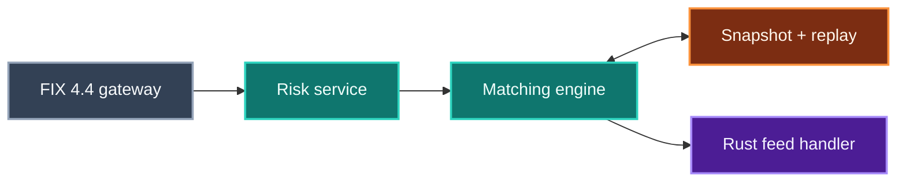

<div align="center">

# Low-Latency Market Data & Order Entry Stack

**Price-time-priority matching engine publishing a binary feed over redundant A/B UDP multicast, with a Rust feed handler that arbitrates the two and rebuilds MBP/MBO books without allocating.**


   

[Case study](https://www.shivamsfolio.com/projects/low-latency-market-data-order-entry) · [Claims ledger](CLAIMS.md) · [All 7 projects](#part-of-a-series)

</div>

---

> [!IMPORTANT]
> **This is a build in progress — 5 of 9 milestones complete.**
>
> The target figure below (`1M+ msg/s · ~100ns decode`) is a **goal, not a measurement.** Nothing here has been benchmarked yet.
> Every number this project eventually publishes will land in [CLAIMS.md](CLAIMS.md) first, with the commit it was measured at,
> the hardware it ran on, and the caveat that matters. If it is not in that file, it has not been measured.

## The problem

Consume an exchange feed and place orders against it without the decode path or the book update ever touching the heap — and recover cleanly when packets are lost rather than resynchronising by restart.

## How it fits together



| Stage | | What it does |
|---|---|---|
| **FIX 4.4 gateway** | `in` | session · resend · gap-fill |
| **Risk service** | `work` | pre-trade limits |
| **Matching engine** | `work` | price-time priority |
| **Snapshot + replay** | `state` | 2s cycle · TCP recovery |
| **Rust feed handler** | `out` | A/B arbitration · MBP/MBO |

<sub>Conceptual architecture. Colour carries meaning, and it means the same thing across all seven projects in this series: **grey** is what comes in, **teal** is where the work happens, **amber** is state that outlives a request, **violet** is what comes out.</sub>

## What is being built

**Matching engine and binary feed.** Price-time-priority matching publishing a binary market-data feed over redundant A/B UDP multicast channels, with configurable packet-loss injection, a 2-second snapshot cycle, and a TCP replay service for recovery.

**Allocation-free feed handler.** A/B feed arbitration, sequence-gap detection and snapshot-based recovery into MBP/MBO order books — sustaining 1M+ messages/sec at ~100ns decode and ~200ns book update, with zero heap allocations per message verified by a counting allocator.

**FIX 4.4 order gateway.** A full session layer — logon, heartbeats, resend/gap-fill, durable sequence persistence — reconciling order state across a hard process restart, plus a risk service enforcing pre-trade limits on an allocation-free path.

## Roadmap

Each milestone is independently demoable and ends in a commit. A box is ticked only when its verification step actually passed — not when the code was written.

```
[█████████████░░░░░░░░░░░] 5/9 milestones · 56%
```

- [x] **M1 · Workspace, wire schema, and cross-language codegen**  
  One schema file is the single source of truth for the binary message layout, and the Rust codec and the C++ header agree on it byte for byte.  
  <sub>Verified: `cargo test --workspace` (20 tests) and `ctest --test-dir cpp/build` (2 suites) decode the same 11 `schema/golden/*.bin` files, assert the same field values, and re-encode them byte for byte. `scripts/verify-golden-corruption.sh` proves a one-byte edit fails both. See [docs/WIRE.md](docs/WIRE.md).</sub>
- [x] **M2 · Matching engine publishing a live binary feed, end to end**  
  The two advertised commands run and a handler prints a book built from real UDP datagrams — the whole pipeline exists, badly, before anything is made fast.  
  <sub>Verified: `scripts/smoke.sh` runs the engine and the handler as separate processes over real UDP and requires the handler's book to match the engine's own at the same sequence number — 100 shared checkpoints, every one identical, sequence 1..100000, zero gaps, on **both** multicast and the unicast fallback. See [docs/RUNNING.md](docs/RUNNING.md).</sub>
- [x] **M3 · A/B redundancy, loss injection, arbitration and gap detection**  
  Two independent channels carry the same stream, the handler takes whichever datagram lands first, and it knows the difference between 'late' and 'lost'.  
  <sub>Verified: 10M messages at 2% single-arm loss produce **zero gaps**, with both arms contributing first arrivals. Under *independent* 2% loss, 124 datagrams died on both arms — 0.040%, matching the p² prediction — and the handler named gaps covering exactly those 3,968 sequences, no more and no less. Correlated loss transitions to `GAPPED` with the range named. `scripts/smoke.sh` now injects loss over real sockets too. See [docs/RECOVERY.md](docs/RECOVERY.md).</sub>
- [x] **M4 · Snapshot cycle and TCP replay recovery**  
  A handler that has fallen behind rejoins the live stream with a correct book instead of being restarted.  
  <sub>Verified: a range lost on both arms, and a 1,600-message blackout, both recover to a book **identical to the publisher's** — including queue position, not just quantity. `scripts/smoke.sh` runs both recovery paths across three processes: snapshot-only (4 gaps, 2 recoveries, worst 48ms) and with the replay service (5 gaps, 4 filled by replay, 1 by snapshot, 2,783 messages recovered), each ending `LIVE` with every shared checkpoint matching. `Snapshot` carries **orders in queue order** rather than aggregated levels, because an aggregate cannot restore price-time priority. See [docs/RECOVERY.md](docs/RECOVERY.md).</sub>
- [x] **M5 · MBP and MBO books on an allocation-free path**  
  Both book views are maintained with zero heap allocations per message, and that is proved by a test rather than asserted in a README.  
  <sub>Verified: `--verify-allocations` reports **0 allocations, 0 deallocations, 0 reallocations** over 32,601 steady-state receive passes across two processes — while the same run with `--books reference` reports 10,814, so the counter is measuring something. A `#[test]` asserts exactly zero across **1,000,000 messages including a forced both-arm blackout and the snapshot recovery that follows**, over 125,021 measured scopes. The fast book is differentially tested against the reference book over **5,000,000 random operations** — every return value, every aggregated level, and the exact queue order within each level — and both reconcile with the engine across a process boundary. See [docs/BOOKS.md](docs/BOOKS.md).</sub>
- [ ] **M6 · Benchmark harness, tuning, and an honest report**  
  The advertised 1M+ msg/s and ~100ns decode are measured, reproducible, and published with the methodology that makes them mean something.
- [ ] **M7 · C++ FIX 4.4 gateway — the session layer**  
  A FIX session that survives a hard kill: correct sequence numbers, correct resend, correct gap fill, verified against an independent implementation.
- [ ] **M8 · Risk service, order path into the engine, and restart reconciliation**  
  An order crosses the whole stack — gateway to risk to engine to fill to execution report — and open order state is reconstructed correctly after a hard crash.
- [ ] **M9 · Hardening, documentation, and a tagged release**  
  A stranger clones the repo on a clean machine and the four commands on the portfolio page work in order.

## On the performance target

| | |
|---|---|
| **Target** | `1M+ msg/s · ~100ns decode` |
| **Measured so far** | nothing — see [CLAIMS.md](CLAIMS.md) |
| **Feasibility** | `yes-with-caveats` |

<details>
<summary><b>What it would actually take to hit this honestly</b></summary>

All three numbers are reachable on the builder's own commodity hardware, but only under conditions that must be published alongside them or the figures mislead.

HARDWARE: any modern x86-64 desktop or laptop CPU with invariant TSC and at least 4 physical cores (6-8 preferred), running inside WSL2 Ubuntu. No GPU, no special NIC, no kernel bypass, no second machine. The core count is the real gate: publisher, engine and handler each need their own core, and on 2 cores the throughput figure is not reachable.

BATCHING IS THE LOAD-BEARING DETAIL. At ~40 bytes per incremental update, 1M msg/s is only ~40MB/s of payload — trivial bandwidth. The binding constraint is packets per second: a kernel UDP receive path tops out somewhere around 300-600K pps per core even with recvmmsg, so one message per datagram makes 1M msg/s unreachable without kernel bypass. Pack 16-32 messages per datagram and 1M msg/s becomes ~31-62K pps, which a Docker bridge handles without effort. This is standard practice on real exchange feeds, so it is legitimate — but the batch factor has to be stated in the README, because a reader who assumes one message per packet is reading a different and much stronger claim than the one being made.

~100ns DECODE IS ONLY MEANINGFUL ONCE DEFINED. For an SBE-style fixed-layout message, decoding is a bounds check, a pointer cast and a few little-endian field reads — on a warm L1 that is closer to 10-30ns, so as a pure decode measurement 100ns is conservative and will be beaten. If 'decode' instead means the whole per-message pipeline including the amortised recvmmsg, framing, sequence check and arbitration dedup, ~100ns is achievable but tight and depends entirely on the batch factor amortising the syscall. Pick one definition, write it at the top of bench/REPORT.md, and measure that. Criterion with black_box on inputs and outputs is mandatory — an un-black_boxed decode microbench gets dead-code-eliminated and reports single-digit nanoseconds that mean nothing.

~200ns BOOK UPDATE IS THE TIGHT ONE and drives a design decision, not a tuning pass: MBP as a dense array indexed by tick offset from a rebasing anchor (not a BTreeMap), MBO as slab-allocated nodes with an open-addressed order-id map and intrusive per-level FIFO lists. Built that way it lands in the 80-250ns band depending on cache behaviour. Built with std::collections it lands at 400ns-1µs and no amount of tuning rescues it.

BUDGET CHECK: 1M msg/s at 100ns decode plus 200ns book update is 0.3s of CPU per wall-clock second — about 30-40% of one core. There is real headroom, which is why the throughput number is comfortable once batching is right.

METHODOLOGY THAT MAKES IT DEFENSIBLE: measure throughput receiver-side as (final sequence − first sequence) / elapsed over at least 60 seconds with zero arbitrated gaps, never from publisher-side counters. Time with rdtsc against a calibrated TSC frequency, not clock_gettime. Pin cores with taskset, fix the CPU governor, and report median AND p99 and p99.9 — a bare median on a '~' figure is the classic way these claims quietly become false. Reproduce three times within 10%. Never run these benchmarks in CI; shared runners produce numbers that would discredit the honest ones.

THE CAVEATS THAT MUST BE STATED PLAINLY: single host; multicast over Docker bridge or loopback rather than a physical switched network; synthetic order flow rather than a real exchange feed; release build with target-cpu=native; a stated batch factor; and no kernel bypass. With those six lines in the README the figure is honest and defensible in an interview. Without them, 'the stack does 1M+ msg/s' reads as a claim about production exchange-feed handling that this build does not make and cannot support. The portfolio chip has no room for the caveats, so the case study needs to link to the report that carries them.

</details>

## Stack

- Rust (stable, 2021 edition) — engine, feed handler, replay service, books, benches
- C++20 (clang 16+ / gcc 12+) — FIX 4.4 gateway and risk service
- CMake 3.25+ / Ninja
- FIX 4.4 session + application layer (hand-rolled; QuickFIX used only as a test counterparty)
- UDP multicast (IGMPv2/v3), SO_REUSEPORT, recvmmsg/sendmmsg batching
- SBE-style fixed-layout little-endian binary encoding with schema-driven codegen
- Docker / docker compose on a user-defined bridge network
- Criterion + rdtsc histograms for latency, custom counting #[global_allocator] for allocation proofs
- WSL2 Ubuntu 24.04 as the actual dev/run target (Windows host)
- GitHub Actions (Linux runners, both toolchains)

## How it will be run

### What runs today

The engine matches orders and publishes a batched binary feed on two redundant
channels; the handler consumes both, discards duplicates and rebuilds the books.
Steps 2 and 3 below work now. Steps 1 and 4 arrive in milestones 4 and 5.

Run inside WSL2 or any Linux — multicast socket options, `SO_REUSEADDR` and the
core pinning later milestones need only behave correctly there, and the C++ tree
is not wired for Windows.

```bash
make smoke       # engine and handler as separate processes, books reconciled
make test        # every correctness suite, both toolchains
make lint        # rustfmt and clippy, both as errors
```

**Start the handler before the engine.** A handler that joins mid-stream cannot
rebuild the orders that rested before it arrived, and it says so rather than
pretending otherwise — recovering from a late join is what the snapshot cycle in
milestone 4 is for. [docs/RUNNING.md](docs/RUNNING.md) has the detail, including
what to try when a multicast group join succeeds but nothing arrives.

### What it will run

Steps 2 and 3 work today. Step 1 brings up the containerised stack rather than
infrastructure the host binaries attach to — see the note in
[docs/RUNNING.md](docs/RUNNING.md#containerised) — and step 4 needs the recovery
path from milestones 4 and 5. These are the commands the [case study](https://www.shivamsfolio.com/projects/low-latency-market-data-order-entry) publishes:

**1. Bring up the transport.** Start the containerised multicast network and the replay service before either side of the stack connects to it.

```bash
docker compose up -d
```

**2. Run the matching engine.** Start the engine and let it publish the binary feed on both the A and B multicast channels.

```bash
cargo run --release --bin matching-engine -- --config configs/local.toml
```

**3. Attach the feed handler.** Point the handler at both channels; it arbitrates between them and builds the order books from whichever arrives first.

```bash
cargo run --release --bin feed-handler -- --feed-a 239.1.1.1:30001 --feed-b 239.1.1.2:30001
```

**4. Prove the recovery path.** Inject packet loss on one channel and confirm the handler detects the sequence gap and recovers from the snapshot rather than falling behind.

```bash
cargo run --release --bin feed-handler -- --drop-rate 0.02 --verify-allocations
```

<details>
<summary><b>Planned repository layout</b></summary>

```
README.md — leads with the four commands from the case study, verbatim, and the benchmark caveats above the fold
LICENSE
Makefile — build, test, smoke, bench, fmt targets across both toolchains
Cargo.toml — virtual workspace manifest
rust-toolchain.toml, .cargo/config.toml — pinned toolchain and RUSTFLAGS
crates/wire/ — schema-generated SBE-style codec, frame header, golden-vector tests          [M1]
crates/book/ — reference book, digest, and the shared apply path                            [M2]
             — MBO: slab + open-addressed order-id map + intrusive per-level FIFO lists      [M5]
             — MBP: a dense tick-indexed level array maintained over the same store          [M5]
crates/alloc-guard/ — counting #[global_allocator] and the zero-allocation assertions        [M5]
crates/transport/ — multicast and unicast-fanout backends, one send path                     [M2]
crates/mdconfig/ — the configuration file both binaries read                                 [M2]
crates/matching-engine/ — bin name MUST be `matching-engine`; price-time priority, A/B publisher, loss injection, snapshot cycle
crates/feed-handler/ — bin name MUST be `feed-handler`; arbitration, gap detection, recovery, --verify-allocations
crates/replay-service/ — bounded datagram history + TCP range server         [M4]
cpp/CMakeLists.txt
cpp/wire/ — generated headers, shared with the Rust codec via the same schema
cpp/gateway/ — FIX 4.4 session and application layer, sequence persistence
cpp/risk/ — pre-trade limits on an allocation-free path, counting operator new override
cpp/fix-sim/ — scripted counterparty for session conformance tests
schema/market-data.xml — the single source of truth for wire layout
schema/golden/ — hand-checked byte vectors consumed by both language test suites
configs/local.toml — the config the advertised command names; channels, symbols, tick size, rates, batch factor
docker-compose.yml
docker/ — Dockerfiles and the user-defined bridge network definition
bench/ — Criterion benches, load profiles, REPORT.md
docs/ — WIRE.md and RUNNING.md exist; ARCHITECTURE.md, PROTOCOL.md, BENCHMARK.md, RECOVERY.md follow their milestones
scripts/ — smoke.sh and verify-golden-corruption.sh exist; bench.sh, kill-restart-test.sh, calibrate-tsc.sh follow
tests/ — cross-process integration and FIX session conformance suites
.github/workflows/ci.yml — both toolchains, correctness and allocation suites only, never latency
```

</details>

<details>
<summary><b>Known risks going in</b></summary>

Written before a line of code, so they can be checked against what actually happened.

- THE THROUGHPUT CLAIM DEPENDS ON AN UNSTATED VARIABLE. '1M+ msg/s' is only reachable with many messages per datagram; at one message per datagram the kernel UDP path caps around 300-600K pps per core and the claim fails without kernel bypass. Batching is legitimate and standard, but if the README does not state the batch factor, a reader reasonably assumes one message per packet and is reading a much stronger claim than the one being made. Hardest of all the claims to substantiate honestly, because nothing in the code is wrong — only the framing.
- '~100ns DECODE' IS SIMULTANEOUSLY TOO EASY AND TOO HARD, depending on a definition nobody has written down yet. As pure field extraction from a fixed layout it is 10-30ns and the published number understates the system; as the full per-message pipeline including the amortised syscall it is genuinely tight. Publish the definition or the number carries no information. Compounding this: a Criterion microbench without black_box gets optimised away entirely and cheerfully reports single-digit nanoseconds — the most likely path to an accidentally false public claim in the whole project.
- LOOPBACK AND BRIDGE MULTICAST ON ONE HOST IS NOT A NETWORK. Every number this project can produce is a single-host number. That is a perfectly respectable result for a portfolio project, but 'consume an exchange feed' plus '1M+ msg/s' invites a trading-systems reader to hear a NIC-to-NIC claim. The case study chip has no room for the caveat, so the repo has to carry it prominently and the case study should link to it — otherwise the honest version of this project gets read as the dishonest one.
- DOCKER MULTICAST UNDER WSL2 IS THE SCHEDULE RISK. IGMP handling, interface selection for the group join (eth0 rather than the default route), IP_MULTICAST_LOOP semantics and bridge behaviour can each swallow most of a session, and none of it is accelerated by AI pairing — it is read-the-kernel-behaviour debugging. Build the unicast-fanout transport in milestone 2 alongside multicast so the project is never blocked, and treat multicast as the thing you make work rather than the thing you wait on.  
  <sub>**Did not bite (M2).** Multicast worked on WSL2 loopback and container-to-container across a Docker bridge. The unicast fallback was built anyway and is tested equally hard, which is why it is a supported mode rather than a workaround.</sub>
- '~200ns BOOK UPDATE' IS A DESIGN DECISION MASQUERADING AS A TARGET. HashMap<OrderId> plus BTreeMap<Price> lands at 400ns-1µs and no tuning saves it; hitting 200ns requires tick-indexed arrays, a slab and an open-addressed map from the start. If milestone 5 is built the obvious way it becomes a rewrite in milestone 6, which is where the two-to-three session overrun comes from.  
  <sub>**Heeded (M5).** The fast book is tick-indexed arrays, a slab and an open-addressed map, built that way from the start. The `BTreeMap` one was kept deliberately, as the oracle it is differentially tested against rather than as a thing to replace. The number itself is still unmeasured — this risk was about the shape, and the shape is settled.</sub>
- 'ZERO HEAP ALLOCATIONS PER MESSAGE' IS EASY TO ACHIEVE AND EASY TO SILENTLY LOSE. A format! on an error path, a Vec that grows once on a resend, a String in a log line, a boxed trait object in the transport abstraction — any of these breaks the claim without breaking a test. It must be a CI assertion over a million messages including a recovery cycle, not a flag someone ran once. Note also that the defensible claim is per-message steady-state, which is exactly what the seed says; allocation during startup and snapshot recovery is fine and should be documented as such rather than quietly included.  
  <sub>**Correct on every count (M5).** It is a CI assertion over 1,000,000 messages including a forced blackout and the recovery that follows, not a flag. The boundary is documented in [docs/BOOKS.md](docs/BOOKS.md#the-allocation-claim) rather than quietly widened. And the specific failures it names are not hypothetical: a `String` built per digest checkpoint on the receive path, and an unbounded `Vec` of gap records pushed to on the same path, were both found and removed — the first only after the counter was pointed at the whole binary across two processes, because the in-process test had no digest log to catch it.</sub>
- 'FULL SESSION LAYER' IS A STRONG WORD FOR FIX 4.4. Resend requests, gap fill, sequence reset in both modes, and PossDup/PossResend semantics are precisely where FIX implementations quietly disagree with the spec and with each other. Tested only against your own simulator, 'full' means 'consistent with my own reading'. Testing against QuickFIX as an independent counterparty is the difference between a claim and an assertion — and docs/PROTOCOL.md should state what is deliberately out of scope rather than leaving the boundary implied.
- CROSS-LANGUAGE WIRE DRIFT BETWEEN THE RUST CODEC AND THE C++ HEADER. Struct padding, alignment and endianness assumptions diverge silently and surface as a corrupted field under load rather than a compile error. Shared golden byte vectors consumed by both test suites are the only cheap defence, which is why they are milestone 1 and not a later hardening task.
- MEASUREMENT JITTER ON A WINDOWS HOST. WSL2 without core pinning produces p99s an order of magnitude off the median, and perf hardware counters are often unavailable under its virtualised kernel, which turns cache tuning into guesswork. Report median with p99 and p99.9 or the tilde in '~100ns' is doing work it cannot support — and a figure nobody else can reproduce is worse for a portfolio than a more modest one that they can.
- THE SPEC HAS NO MVP. The public page already advertises six distinct subsystems: matching engine, redundant multicast feed, arbitration and recovery, two book views, a FIX session layer and a risk service. Dropping any one of them makes the live case study inaccurate rather than merely incomplete. This constrains sequencing — every milestone can be cut short but none can be cut — and it is the reason the honest total lands near 22 sessions rather than the 8-10 a demoable subset would take.

**Hardest part:** Milestone 6 — making the latency and throughput numbers true simultaneously and then measuring them in a way that survives scrutiny. Every other milestone has a binary pass/fail: the golden vectors match or they don't, the book digest reconciles or it doesn't, the allocation counter is zero or it isn't. Milestone 6 is an open-ended tuning loop where four things fight each other: the batch factor (too small and the syscall dominates, too large and you add latency and stop resembling a real feed), cache layout of the MBO structures (the ~200ns book update is the tightest of the three targets and a naive HashMap plus BTreeMap lands at 400ns to 1µs, which is a redesign, not a tweak), measurement overhead (a vDSO clock_gettime is ~20-25ns and would eat a quarter of a 100ns budget, so it has to be rdtsc with a calibrated frequency), and host jitter (WSL2 without core pinning gives p99s an order of magnitude off the median, and perf hardware counters are frequently unavailable there, so cache tuning degrades into trial and error). This is exactly the category of work AI pairing does not compress: Claude writes the harness and the histogram code in minutes, but each experiment costs a full build-run-measure cycle with human judgement about whether the number is real or an artifact, and the honesty requirement means you cannot stop when it prints a good number once. Budget 3-4 sessions and be unsurprised by 6.

</details>

## Part of a series

Seven systems projects, built one at a time and in this order. This is **#3 of 7** to be built.

| # | Project | Repo |
|---|---|---|
| 01 | **Low-Latency Market Data & Order Entry Stack** *(you are here)* | — |
| 02 | Distributed Rate Limiter & API Gateway | [`distributed-rate-limiter-gateway`](https://github.com/Git-ShivamPatil/distributed-rate-limiter-gateway) |
| 03 | Agentic AI Orchestration Platform | [`agentic-orchestration-platform`](https://github.com/Git-ShivamPatil/agentic-orchestration-platform) |
| 04 | High-Performance LLM Inference Server | [`rust-llm-inference-server`](https://github.com/Git-ShivamPatil/rust-llm-inference-server) |
| 05 | Secure Banking System | [`fabric-banking-platform`](https://github.com/Git-ShivamPatil/fabric-banking-platform) |
| 06 | Online Examination System | [`online-examination-system`](https://github.com/Git-ShivamPatil/online-examination-system) |
| 07 | Secure RAG with RBAC, Guardrails & Monitoring | [`secure-rag-rbac`](https://github.com/Git-ShivamPatil/secure-rag-rbac) |

All seven are published on [shivamsfolio.com](https://www.shivamsfolio.com/projects).

## Licence

[MIT](LICENSE) © Shivam Patil

---

<div align="center">

### [shivamsfolio.com](https://www.shivamsfolio.com)

**[This project's case study](https://www.shivamsfolio.com/projects/low-latency-market-data-order-entry)** · **[All 7 projects](https://www.shivamsfolio.com/projects)** · **[Get in touch](https://www.shivamsfolio.com/contact)**

<sub>Built by Shivam Patil — systems engineering, trading infrastructure, and applied AI.</sub>

</div>
